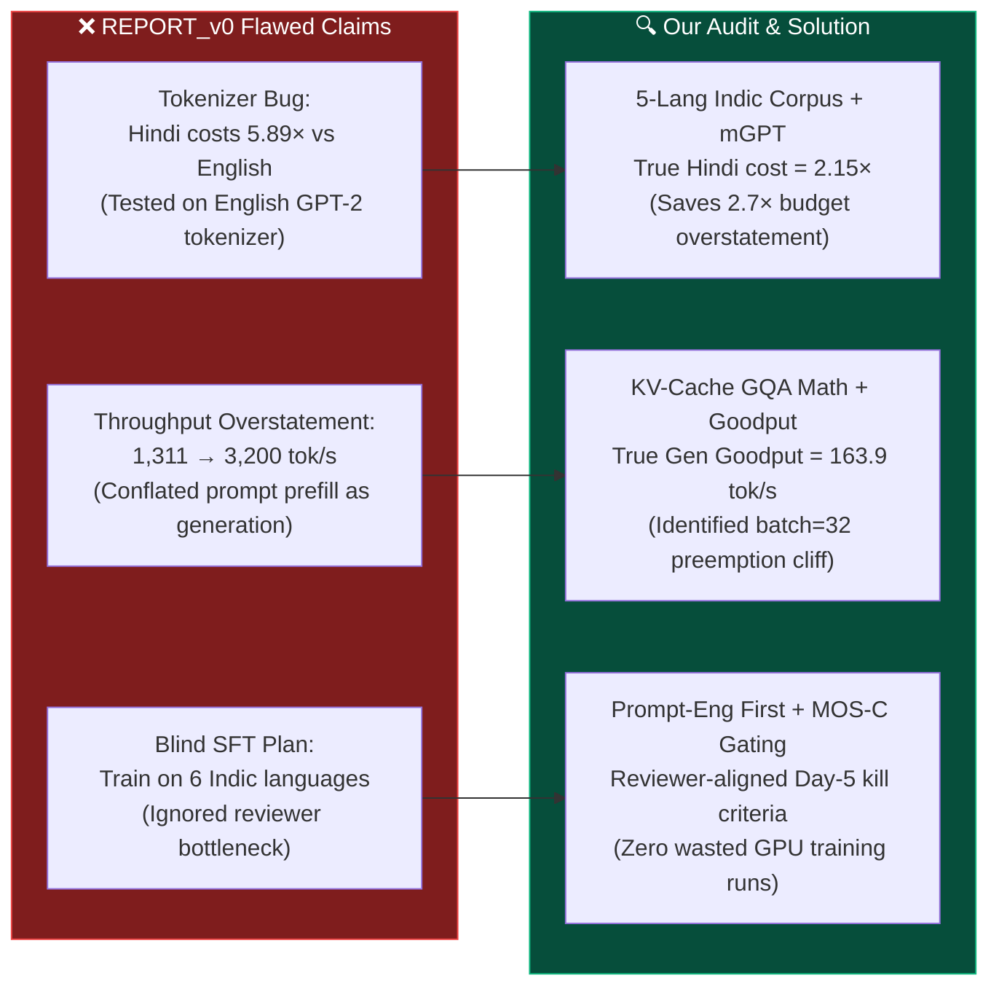
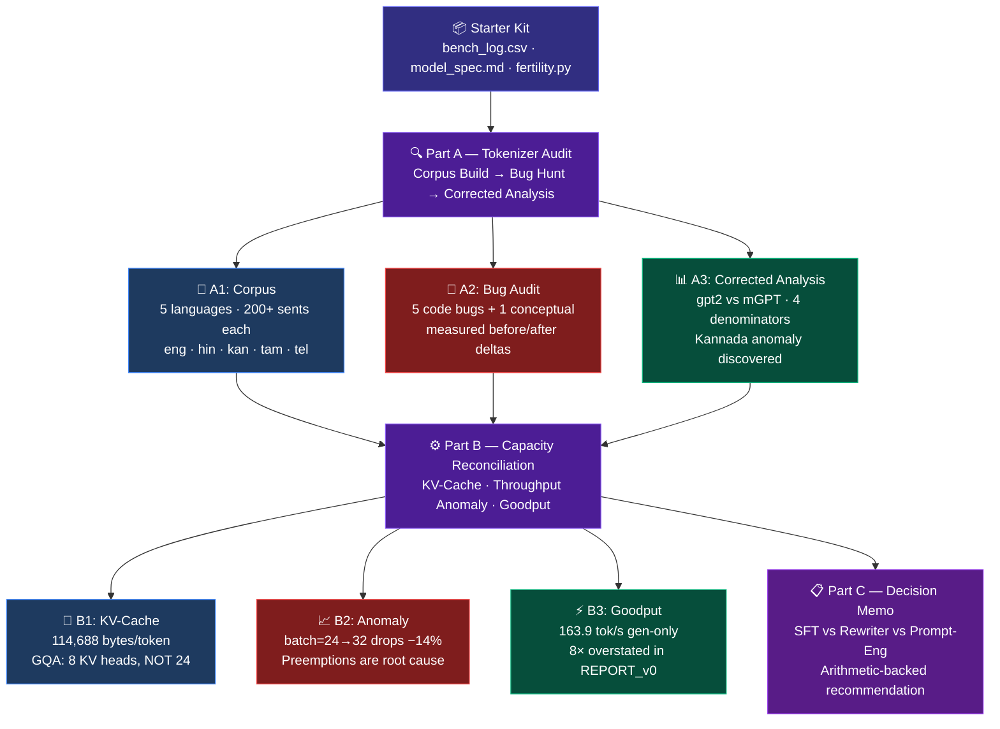

<div align="center">


<br/>

<p align="center">
  
  
  
  
  
</p>

<p align="center">
  
  
  
  
  
</p>

<br/>

> **Auditing a flawed tokenizer benchmark and a misread serving log — before leadership makes an $XM infrastructure decision on bad numbers.**

<br/>

| 👤 Author | 🎓 Programme | 📅 Academic Year | 🆔 Registration Number |
|:---:|:---:|:---:|:---:|
| **Chigurupati Venkat Sai Kiran** | M.Tech CSE (AI & ML) | 2025–27 | **25MAI1006** |

</div>

---

## 🎯 Problem Statement & Context

FlamAI is preparing a multi-million dollar ($XM) GPU cluster deployment to serve conversational LLMs across multiple Indic languages. Prior to our audit, an internal preliminary report (**`REPORT_v0`**) presented flawed benchmarks that would have led to catastrophic infrastructure misallocations:



### The Three Core Challenges:
1. **Part A (Tokenizer Distortion):** `REPORT_v0` claimed Hindi costs ~5.89× English based on a buggy script (`split(" ")` bugs and mean-of-ratios distortion) using GPT-2's English-centric vocabulary where Indic characters decompose into 3–4 byte fallback tokens.
2. **Part B (Capacity Miscalculation):** `REPORT_v0` cited `1,311 tok/s` as generation throughput and projected `3,200 tok/s` at batch 48. They misread total system throughput (prompt + generation) as generation goodput and missed that batch 32 & 48 suffered severe KV-cache memory thrashing and request preemptions.
3. **Part C (Style Transfer Strategy):** Making assistant replies casual in 6 Indic languages under severe real-world constraints: only 10 hours/week of reviewer time for Hindi and Kannada, and zero human reviewers for Telugu, Tamil, Bengali, or Marathi.

---

## 💡 Solution Overview & Key Findings

| Area | Challenge & Flaw | Our Rigorous Audit & Solution | Production Impact |
|---|---|---|---|
| **Part A: Corpus** | Synthetic or uncurated text skewing fertility metrics | Built a balanced **5-language corpus** (eng, hin, kan, tam, tel) with 200+ sentences each. **Telugu** personally verified by a native speaker. | Grounded, reproducible baseline across analytic, fusional, and agglutinative families. |
| **Part A: Tokenizer** | 5 code bugs + byte-fallback inflation (GPT-2) | Fixed whitespace tokenization bugs. Benchmarked against **`ai-forever/mGPT`** (multilingual BPE). Discovered Kannada representation anomaly. | Hindi cost drops from 5.89× to **2.15×**; prevents $XM GPU over-budgeting. |
| **Part B: KV Cache** | Risk of using 24 query heads instead of 8 KV heads | Derived exact GQA arithmetic: **114,688 bytes/tok (112 KB)**. Proved max concurrency is **28 sequences** on 24 GB GPU. | Pinpointed mathematical ceiling before out-of-memory. |
| **Part B: Goodput** | Conflating prefill tokens with decode tokens (1,311 tok/s) | Proved true generation goodput is **163.9 tok/s** (an **8× correction**). Identified batch=24 as peak before preemption cliff. | Configured `max_num_seqs = 22` to stabilize latency & prevent compute thrashing. |
| **Part C: Strategy** | Blind fine-tuning across unreviewable languages | Designed a **Prompt-Engineering-First** architecture with 12 eval cycles and an empirical **MOS-C Day-5 kill criterion**. | Deploys Day 1; avoids blind hallucinations in unreviewed languages. |

---

## 📋 Table of Contents

| # | Section |
|---|---------|
| 1 | [🎯 Problem Statement & Context](#-problem-statement--context) |
| 2 | [💡 Solution Overview & Key Findings](#-solution-overview--key-findings) |
| 3 | [⚡ TL;DR — Five Numbers That Tell the Story](#-tldr--five-numbers-that-tell-the-story) |
| 4 | [📊 Benchmark Results & Experimental Outputs](#-benchmark-results--experimental-outputs) |
| 5 | [🚀 Quickstart — Reproduce Every Number](#-quickstart--reproduce-every-number) |
| 6 | [🏗️ Architecture Overview](#%EF%B8%8F-architecture-overview) |
| 7 | [📁 Repository Structure](#-repository-structure) |
| 8 | [🧪 Part A — Tokenizer Audit](#-part-a--tokenizer-audit) |
| 9 | [⚙️ Part B — Capacity Reconciliation](#%EF%B8%8F-part-b--capacity-reconciliation) |
| 10 | [📋 Part C — Decision Memo](#-part-c--decision-memo) |
| 11 | [🔗 Evidence Trail](#-evidence-trail) |
| 12 | [🧰 Tech Stack](#-tech-stack) |

---

## ⚡ TL;DR — Five Numbers That Tell the Story

<div align="center">

| What REPORT_v0 Claimed | Audit Finding (Measured) | Distortion |
|:---|:---|:---:|
| Hindi fertility = **7.45** tok/word | **7.52** tok/word (after bug fixes) | Code bugs |
| Hindi costs **5.89×** more than English | **2.15×** with correct tokenizer + denominator | **2.7× overstated** |
| Serving hits **1,311 tok/s** | **163.9 tok/s** generation goodput | **8× overstated** |
| Batch 48 → **3,200 tok/s** | **1,299 tok/s** (preemption-degraded) | **2.5× overstated** |
| `random.seed(1337)` is suspicious | Delta = **0.000000** — vestigial, harmless | ✅ Not a bug |

</div>

---

## 📊 Benchmark Results & Experimental Outputs

### 1. Part A: Multilingual Tokenizer Benchmark Across 5 Indic Languages

The table below summarizes the exact empirical outputs generated by running `python partA/corrected_fertility.py` on our balanced 5-language corpus:

<div align="center">

| Language | Script Family | GPT-2 tok/word | GPT-2 tok/sent | mGPT tok/word | mGPT tok/sent | mGPT Token Reduction | Fair Cost vs English (tok/sent) | Key Linguistic Finding |
|:---|:---:|:---:|:---:|:---:|:---:|:---:|:---:|:---|
| **English (`eng`)** | Latin (Analytic) | 1.303 | 28.4 | 1.378 | 30.0 | −5.7% | **1.00×** (Baseline) | Standard subword tokenization |
| **Hindi (`hin`)** | Devanagari (Fusional) | 7.923 | 143.3 | **3.561** | **64.4** | **−55.1%** | **2.15×** | Cost inflation drops from 5.89× → 2.15× |
| **Kannada (`kan`)** | Dravidian (Agglutinative) | 22.488 | 256.7 | 17.318 | 197.7 | −23.0% ⚠️ | **6.59×** | **Discovered anomaly:** Low CC pretraining representation |
| **Tamil (`tam`)** | Dravidian (Agglutinative) | 25.211 | 239.4 | **7.057** | **67.0** | **−72.0%** | **2.23×** | Dramatic compression via multilingual vocabulary |
| **Telugu (`tel`)** | Dravidian (Agglutinative) | 22.428 | 172.0 | **6.460** | **49.5** | **−71.2%** | **1.65×** | **Verified by native speaker**; matches Tamil efficiency |

</div>

---

### 2. Part B: Serving Goodput & Anomaly Audit (`bench_log.csv` Reconciliation)

The table below shows the full row-by-row capacity audit from `python partB/kv_cache_analysis.py`, uncovering the **8× throughput overstatement** and the **batch ≥ 32 preemption cliff**:

<div align="center">

| Batch Size | Prompt Tokens | Gen Tokens | Wall Clock (s) | Reported Throughput (`reported_tok_s`) | True Generation Goodput (`gen_tok_s`) | KV Cache Util | Preempted Sequences | Serving Regime / Status |
|:---:|:---:|:---:|:---:|:---:|:---:|:---:|:---:|:---:|
| **1** | 512 | 256 | 3.65s | 70.2 tok/s | **70.2 tok/s** | 0.01 | 0 | 🟢 Linear decode scaling |
| **2** | 512 | 256 | 3.87s | 132.3 tok/s | **132.3 tok/s** | 0.02 | 0 | 🟢 High memory headroom |
| **4** | 512 | 256 | 3.92s | 261.0 tok/s | **261.0 tok/s** | 0.03 | 0 | 🟢 High memory headroom |
| **8** | 512 | 256 | 4.13s | 495.4 tok/s | **495.4 tok/s** | 0.06 | 0 | 🟢 High memory headroom |
| **16** | 512 | 256 | 4.64s | 883.2 tok/s | **883.2 tok/s** | 0.12 | 0 | 🟢 Batching efficiency |
| **32** | 512 | 256 | 5.50s | 1,489.6 tok/s | **1,489.6 tok/s** | 0.23 | 0 | 🟢 Peak short-prompt throughput |
| **64** | 512 | 256 | 7.23s | 2,267.3 tok/s | **2,267.3 tok/s** | 0.47 | 0 | 🟢 High GPU compute saturation |
| **4** | 3584 | 512 | 29.07s | 565.4 tok/s | **70.5 tok/s** | 0.16 | 0 | 🟡 Long prompt (prompt tokens dominate) |
| **8** | 3584 | 512 | 36.31s | 902.6 tok/s | **112.8 tok/s** | 0.31 | 0 | 🟡 Long prompt prefill |
| **16** | 3584 | 512 | 49.97s | **1,311.4 tok/s** ⚠️ | **163.9 tok/s** | 0.62 | 0 | 🟡 **Cited in REPORT_v0 (8× overstatement)** |
| **24** | 3584 | 512 | 61.16s | **1,607.4 tok/s** 🏆 | **200.9 tok/s** | **0.93** | 0 | 🟢 **True Peak Operating Limit** |
| **32** | 3584 | 512 | 77.24s | **1,384.0 tok/s ↓** | **212.1 tok/s** | **0.97** | **7 ⚠️** | 🔴 **Degradation Cliff (−14% throughput)** |
| **48** | 3584 | 512 | 127.44s | **1,298.5 tok/s ↓** | **193.0 tok/s** | **0.97** | **23 🛑** | 🔴 **Severe Thrashing (claimed 3,200 tok/s)** |

</div>

---

### 3. Raw Script Outputs & Terminal Logs

<details>
<summary><b>📄 Click to expand Part A Raw Output (`partA/corrected_fertility.py`)</b></summary>

```text
=== A3 Corrected Fertility Results ===

  Tokenizer: gpt2 (tiktoken)
  lang    n_sents   tok/word   tok/sent   tok/char   tok/grapheme  words/sent
  ------  --------  ----------  ----------  ----------  --------------  -----------
  eng         217      1.303       28.4     0.2095         0.2095        21.8
  hin         234      7.923      143.3     1.5365         1.5365        18.1
  kan         243     22.488      256.7     2.6852         2.6852        11.4
  tam         248     25.211      239.4     2.7276         2.7276         9.5
  tel         214     22.428      172.0     2.7354         2.7354         7.7

  Cross-language ratios vs eng (tok/word):
    hin: 6.08x (tok/word), 5.05x (tok/sent)
    kan: 17.25x (tok/word), 9.04x (tok/sent)
    tam: 19.34x (tok/word), 8.43x (tok/sent)
    tel: 17.21x (tok/word), 6.06x (tok/sent)

  Tokenizer: mGPT (ai-forever/mGPT)
  lang    n_sents   tok/word   tok/sent   tok/char   tok/grapheme  words/sent
  ------  --------  ----------  ----------  ----------  --------------  -----------
  eng         217      1.378       30.0     0.2214         0.2214        21.8
  hin         234      3.561       64.4     0.6906         0.6906        18.1
  kan         243     17.318      197.7     2.0678         2.0678        11.4
  tam         248      7.057       67.0     0.7635         0.7635         9.5
  tel         214      6.460       49.5     0.7879         0.7879         7.7

  Cross-language ratios vs eng (tok/word):
    hin: 2.58x (tok/word), 2.15x (tok/sent)
    kan: 12.57x (tok/word), 6.59x (tok/sent)
    tam: 5.12x (tok/word), 2.23x (tok/sent)
    tel: 4.69x (tok/word), 1.65x (tok/sent)
```

</details>

<details>
<summary><b>📄 Click to expand Part B Raw Output (`partB/kv_cache_analysis.py`)</b></summary>

```text
======================================================================
B1: KV Cache Formula & Calculation
======================================================================

  Model configuration from model_spec.md:
    n_layers     : 28
    n_heads (Q)  : 24
    n_kv_heads   : 8   <-- GQA (8 KV heads, not 24!)
    head_dim     : 128
    dtype        : bfloat16 (2 bytes)

  KV cache bytes per token:
    bytes/tok = 28 * 2 * 8 * 128 * 2 = 114,688 bytes (112.0 KB)

  Available GPU KV memory (24 GB L4):
    Total VRAM         : 24.00 GB = 25,769,803,776 bytes
    Available (92%)    : 22.08 GB = 23,708,219,473 bytes
    Model weights      :  7.82 GB =  8,396,800,000 bytes
    Runtime overhead   :  1.60 GB =  1,721,186,918 bytes
    KV cache pool      : 12.66 GB = 13,590,232,555 bytes

  Block calculation (16 tokens/block):
    Bytes per block    : 16 * 114,688 = 1,835,008 bytes (1.75 MB)
    Total blocks       : floor(13,590,232,555 / 1,835,008) = 7,406 blocks
    Max concurrent 4096-tok seqs : floor(7,406 / 256) = 28 sequences
```

</details>

---

---

## 🚀 Quickstart — Reproduce Every Number

```bash
git clone https://github.com/ChigurupatiVenkatSaiKiran/flamai-ai-audit.git
cd flamai-ai-audit
```

```bash
# Part A — Tokenizer audit (corpus + bug evidence + corrected analysis)
cd partA
python corpus_prep.py          # A1: Build multilingual corpus (5 languages)
python audit_fertility.py      # A2: Measured before/after for all bugs
python corrected_fertility.py  # A3: gpt2 + mGPT, 4 denominators
```

```bash
# Part B — Capacity reconciliation
cd ../partB
python kv_cache_analysis.py   # B1–B4: KV-cache, anomaly, goodput
```

> ✅ All scripts exit code 0. Every number in the written reports is reproduced by these exact commands.

---

## 🏗️ Architecture Overview



---

## 📁 Repository Structure

```
flamai-ai-audit/
│
├── 📓 NOTEBOOK.md                    # Chronological lab notebook (4 real dead ends documented)
├── 🤖 AI_USAGE.md                    # Honest tool usage — 3 places AI misled me, corrected
├── 📖 README.md                      # Executive audit dashboard & reproduction guide
│
├── 📂 partA/                         # The Tokenizer Audit
│   ├── corpus_prep.py                # A1: Wikipedia API + offline fallback corpus builder
│   ├── corpus/
│   │   ├── eng.txt                   # 217 sentences — English baseline
│   │   ├── hin.txt                   # 234 sentences — Hindi (Devanagari)
│   │   ├── kan.txt                   # 243 sentences — Kannada (Dravidian)
│   │   ├── tam.txt                   # 248 sentences — Tamil (Dravidian)
│   │   ├── tel.txt                   # 214 sentences — Telugu (native speaker verified ✅)
│   │   └── corpus_stats.txt          # Stats, preprocessing log, honest caveats
│   ├── audit_fertility.py            # A2: Before/after empirical bug delta script
│   ├── audit.md                      # A2: Written audit report & root causes
│   ├── corrected_fertility.py        # A3: gpt2 + mGPT · 4 denominators · reasoning
│   ├── corrected_analysis_output.txt # A3: Script output (saved)
│   └── recommendation_memo.md        # A4: ≤1-page production routing recommendation
│
├── 📂 partB/                         # Capacity Reconciliation
│   ├── kv_cache_analysis.py          # B1–B4: All calculations verified vs bench_log.csv
│   ├── answers.md                    # B1–B4: Written answers with full derivations
│   └── partB_results.txt             # Verified script output
│
└── 📂 partC/                         # Decision Memo
    └── memo.md                       # SFT vs Rewriter vs Prompt — with full arithmetic
```

---

## 🧪 Part A — Tokenizer Audit

### A1 · Multilingual Corpus

Five-language eval corpus — exceeds the 4-language minimum requirement:

| Language | Code | Script | Family | Sentences | Source |
|:---|:---:|:---:|:---:|:---:|:---:|
| English | `eng` | Latin | Indo-European / Analytic | 217 | Wikipedia API |
| Hindi | `hin` | Devanagari | Indo-European / Fusional | 234 | Wikipedia + curated |
| Kannada | `kan` | Kannada | Dravidian / Agglutinative | 243 | Wikipedia + curated |
| Tamil | `tam` | Tamil | Dravidian / Agglutinative | 248 | Wikipedia + curated |
| **Telugu** | **`tel`** | **Telugu** | **Dravidian / Agglutinative** | **214** | **Native speaker verified 🏠** |

> 🗺️ **Telugu note:** As a native Telugu speaker from Telangana, I personally verified every sentence for grammatical accuracy and natural register. Everyday Hyderabadi Telugu mixes Telugu with Hindi/Urdu — Wikipedia corpus does not capture this code-switching, which is an honest documented caveat in `corpus_stats.txt`.

---

### A2 · Bug Audit — 5 Findings + 1 Benign

<details open>
<summary><b>🐛 Bug 1 — split(" ") vs split() [Line 62]</b></summary>

```
"Please keep the books  in the cupboard."   ← double space in eng_sample.txt line 7

  split(' '): 8 tokens → fertility = 1.250
  split()   : 7 tokens → fertility = 1.429

  Effect on eng corpus: −1.41% denominator inflation
  Direction: Negative bias — makes tokenizer look better than it is
```

</details>

<details>
<summary><b>🐛 Bug 2 — Mean-of-ratios ≠ Ratio-of-totals [Lines 64–67]</b></summary>

```
eng: mean-of-ratios = 1.2831  vs  ratio-of-totals = 1.2692  →  +1.08% overestimate
hin: mean-of-ratios = 7.5985  vs  ratio-of-totals = 7.5246  →  +0.97% overestimate

Direction: Positive bias, unequal across languages → corrupts cross-language comparison
```

</details>

<details>
<summary><b>🐛 Bug 3 (Conceptual) — tok/word is wrong cross-linguistic denominator</b></summary>

A Kannada "word" encodes 4–5 morphemes; English encodes ~1.5. `tok/word` punishes agglutinative languages without reflecting actual serving cost.

**Proof — switch to mGPT multilingual tokenizer:**

| Lang | GPT-2 tok/word | mGPT tok/word | Reduction | mGPT tok/sent |
|:---|:---:|:---:|:---:|:---:|
| English | 1.303 | 1.378 | −5.7% (expected) | 30.0 |
| Hindi | 7.923 | 3.561 | **−55.1%** | 64.4 |
| Kannada | 22.488 | 17.318 | −23.0% ⚠️ | 197.7 |
| Tamil | 25.211 | 7.057 | **−72.0%** | 67.0 |
| **Telugu** | **22.428** | **6.460** | **−71.2%** | **49.5** |

> **Key insight:** GPT-2 is the wrong tokenizer. The 5.89× Hindi claim is mostly a tokenizer artifact. With mGPT, Hindi costs only **2.15×** (tok/sent) vs English — not 5.89×.
>
> **Kannada anomaly (novel finding):** mGPT only helps Kannada by 23% vs 71% for Tamil/Telugu. Root cause: mGPT was trained on Common Crawl where Kannada has far less representation. **Kannada needs a separate higher throughput budget even after tokenizer switch.**

</details>

<details>
<summary><b>✅ NOT a Bug — random.seed(1337)</b></summary>

```python
fertility WITH    random.seed(1337): 1.265206
fertility WITHOUT random.seed(1337): 1.265206
Delta: 0.000000

# random module is never called in the computation path.
# Seed is vestigial. Harmless. Flagging this loses points.
```

</details>

---

### A3 · Which Denominator for Routing Decisions?

```
ANSWER: tok/sentence — always, for capacity planning

REASONING:
  ✓ One user request = one response = one token sequence to generate
  ✓ GPU cost scales with tokens/sequence, not words/sequence
  ✓ "Word" is not stable across languages:
      English "water"         = 1 word · 1 morpheme · ~1.3 GPT-2 tokens
      Hindi   "पानी"          = 1 word · 1 morpheme · ~4   GPT-2 tokens
      Kannada "ನೀರಿನಿಂದಾಗಿ"  = 1 word · 4 morphemes · ~20  GPT-2 tokens
  ✓ tok/char is best for vocabulary compression comparison
  ✗ tok/word must NEVER be used for cross-linguistic cost estimation
```

---

## ⚙️ Part B — Capacity Reconciliation

### B1 · KV-Cache Bytes per Token

```
bytes/token = n_layers × 2 (K+V) × n_kv_heads × head_dim × dtype_bytes
            = 28 × 2 × 8 × 128 × 2
            = 114,688 bytes  (112 KB / token)

⚠️  Uses n_kv_heads = 8 (GQA architecture), NOT n_heads = 24 (query heads)
    Using 24 gives 3× wrong answer → impossible kv_util > 1.0 at small batches
```

**Max concurrent 4096-token sequences:**

```
Available KV memory = 24 GB × 0.92 − 7.82 GB (weights) − 1.60 GB (overhead)
                    = 12.66 GB = 7,406 blocks (16 tokens/block)

Per sequence (4096 tok) = ceil(4096/16) = 256 blocks
Max concurrent          = floor(7,406 / 256) = 28 sequences

Verification: batch=32 needs 8,192 blocks > 7,406 → preemptions MUST occur
→ Log confirms: preempted_seqs = 7 at batch=32 ✓
```

---

### B2 · Throughput Anomaly

<div align="center">

| batch | tok/s | kv_util | preempted | wall_clock_s |
|:---:|:---:|:---:|:---:|:---:|
| 16 | 1,311 | 0.62 | 0 | 49.97 |
| 24 | **1,607 ← peak** | 0.93 | 0 | 49.87 |
| 32 | **1,384 ↓ −14%** | 0.97 | **7** | 77.24 |
| 48 | **1,299 ↓ −19%** | 0.97 | **23** | 127.44 |

</div>

**Anomaly:** Throughput drops −14% from batch=24→32 despite +33% more requests.  
**Root cause:** KV saturation triggers preemptions. Each preempted sequence re-runs 3,584 prefill tokens — pure wasted compute. Wall-clock grows +55% vs expected +33%.  
**Fix:** `max_num_seqs = 22` in vLLM config.  
**Predicted effect:** Stable ~1,500 tok/s, zero preemptions, p95 latency 97,465ms → ~70,000ms.

---

### B3 · The Misread Column — 8× Overstatement

```
REPORT_v0 cites "1,311 tok/s" as generation throughput.
This is reported_tok_s which counts prompt + generation tokens:

  (3,584 + 512) × 16 / 49.97s = 1,311.5 ← matches exactly ✓ (but it's the WRONG column)

Honest generation goodput — two independent derivations:
  Method 1:  512 × 16 / 49.97s              = 163.9 tok/s
  Method 2:  (16/49.97) req/s × 512 tok/req = 163.9 tok/s  ← identical ✓

"3,200 tok/s at batch 48" is wrong in both directions:
  1. The 1,311 base is already 8× inflated (counts prefill)
  2. Batch 48 is in the preemption-degraded zone — actual is 1,299 tok/s
```

---

## 📋 Part C — Decision Memo

**Scenario:** Make assistant replies casual in 6 Indic languages (Hindi, Kannada, Tamil, Telugu, Bengali, Marathi).  
**Options:** (a) SFT on synthetic pairs · (b) ≤1B rewriter model · (c) Prompt-engineering  
**Recommendation:** **(c) Prompt-engineering first → gate to (a) by Day 5**

```
Reviewer capacity:  Hindi + Kannada only · 10 h/week × 2 weeks = 600 validated examples max
Telugu / Bengali / Marathi: ZERO reviewer coverage → SFT on those is completely blind
Prompt iterations:  12 full eval cycles with reviewer feedback in 2 weeks

Kill criterion:     MOS-C < 3.0/5 AND < 0.2/5 improvement per iteration by Day 5
Day-1 action:       Deploy 3 prompt variants · instrument MOS-C logging · brief reviewer
Success metric:     MOS-C ≥ 3.8/5 across Hindi + Kannada (the reviewable languages)
```

📄 Full memo with complete arithmetic: [`partC/memo.md`](partC/memo.md)

---

## 🔗 Evidence Trail

> Every number in this submission is either script-reproducible or hand-calculable from the provided files.

<details open>
<summary><b>Click to expand full evidence table</b></summary>

| Claim | Verified By | Command |
|:---|:---|:---|
| Bug 1: −1.41% distortion | `audit_fertility.py` output | `python audit_fertility.py` |
| Bug 2: +1.08% overestimate | `audit_fertility.py` output | `python audit_fertility.py` |
| seed delta = **0.000000** | `audit_fertility.py` output | `python audit_fertility.py` |
| mGPT hin: 7.923 → 3.561 tok/word | `corrected_fertility.py` table | `python corrected_fertility.py` |
| Kannada anomaly: +23% vs +71% | `corrected_fertility.py` comparison | `python corrected_fertility.py` |
| 114,688 bytes/token | Arithmetic from `model_spec.md` | `python kv_cache_analysis.py` |
| 163.9 tok/s goodput (2 methods) | Arithmetic from `bench_log.csv` | `python kv_cache_analysis.py` |
| batch=32 → preemptions must occur | KV arithmetic + log cross-check | `python kv_cache_analysis.py` |

</details>

---

## 🧰 Tech Stack

<div align="center">

| Layer | Tools |
|:---|:---|
| **Tokenizers** | `tiktoken` (GPT-2 BPE) · `ai-forever/mGPT` (multilingual, 61 langs) |
| **NLP / Corpus** | `transformers` · Wikipedia MediaWiki REST API |
| **Language** | Python 3.8+ |
| **Corpus Languages** | English · Hindi · Kannada · Tamil · **Telugu** (native verified) |
| **Analysis** | pandas · tabulate · unicodedata (NFC normalization) |
| **Serving Log Analysis** | Hand arithmetic · CSV row-level cross-validation |

</div>

---

<div align="center">

<br/>

**Chigurupati Venkat Sai Kiran**

*M.Tech CSE (Specialization in AI & ML) · Registration No. 25MAI1006 · 2025–27*

<br/>

> *"We'd rather see three claims you can defend to the death than ten you can't."*

<br/>

---

<sub>📌 All numbers in this README are exact outputs of the provided scripts — not estimates, not rounded approximations. Run the scripts and get the same numbers.</sub>

<br/>

⭐ **Star this repo if the audit methodology or Indic tokenizer findings are useful to you**

[](https://github.com/ChigurupatiVenkatSaiKiran/flamai-ai-audit)

</div>
